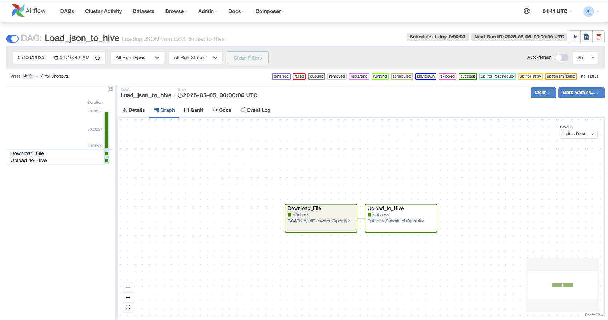

# Load JSON Data from GCS to Hive on Dataproc



## 📌 Objective

This project implements an Apache Airflow DAG that performs the following:

- Downloads a JSON file (`Employee.json`) from a Google Cloud Storage (GCS) bucket.
- Submits a PySpark job to a Dataproc cluster that:
  - Creates a Hive database and table (if not already present).
  - Reads the JSON file, infers schema, and appends data into a Hive table (`EMP_DB.employee`) stored as Parquet.

---

## 🧰 Tech Stack

- **Airflow** (Python DAG)
- **Google Cloud Platform**
  - Cloud Storage
  - Dataproc
- **Apache Spark** (via PySpark)
- **Hive** (on Dataproc)
- **Python**

---

## 📁 File Structure

```bash
.
├── dags/
│   ├── Load_json_to_hive.py         # Airflow DAG definition
│   ├── spark_job/
│   │   └── spark_job.py             # PySpark script executed on Dataproc
│   ├── data/
│   │   └── Employee.json            # Input JSON data in GCS
│   └── DAG_flow.png                 # DAG architecture image

